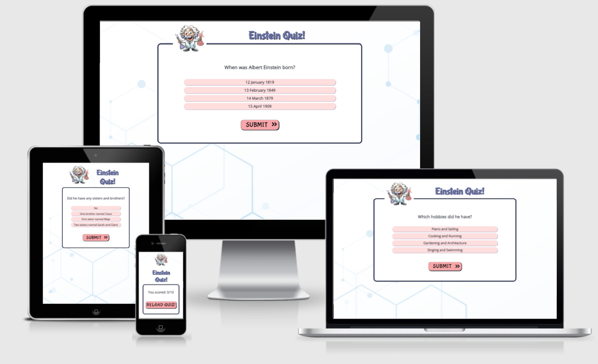
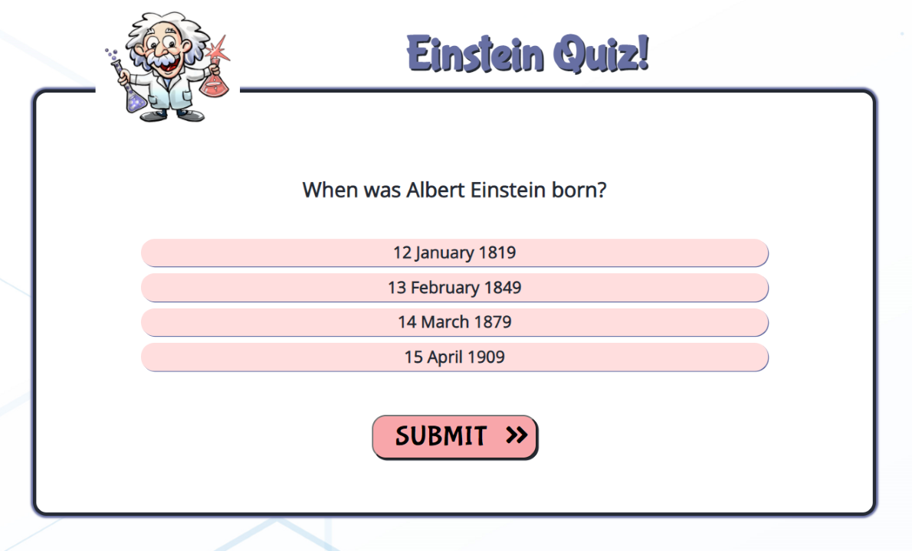
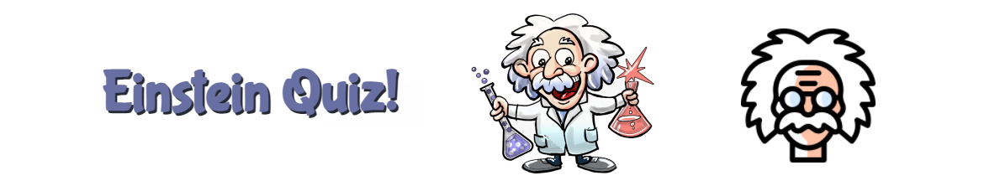
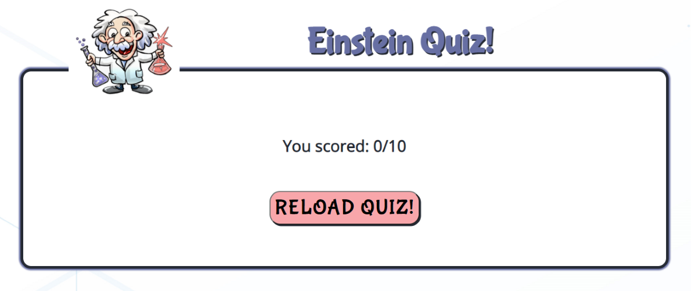
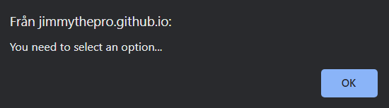
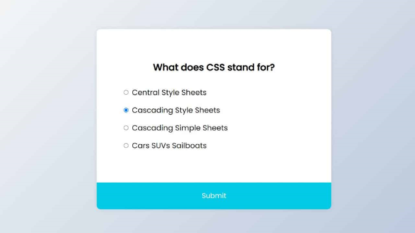
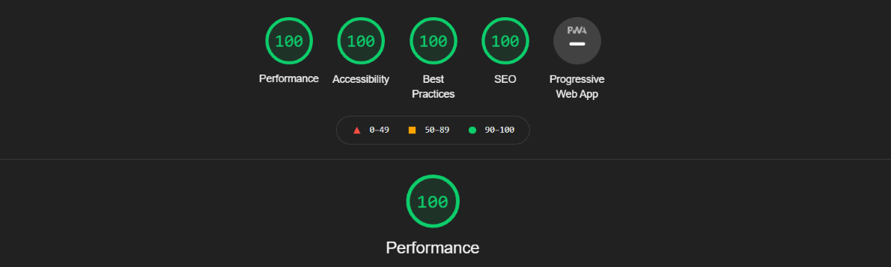

# **Einstein Quiz**
"Einstein Quiz" is a site with Albert Einstein questions. This fun quiz site is for people that want to try their knowledge of Albert Einsten's life, and of course for quiz addicted people.
This site have 10 questions, with four answer options each, and one of them is the correct answer.... can't wait? ...go try this quiz now: https://jimmythepro.github.io/einstein-quiz/
  

## Features

* **Main quiz page**

    - This fully responsive page will allow all users to easy start the quiz, without hassle.
    - First question is shown to the user, when site opens in a browser.
    - User get 4 options to choose from, and then press submit button to get next question.
    - When clicking on one of the 4 "options", the option is turned to another color so it's easy to see what he/she selected.
    - When next question appears, all radio buttons is unselected, so user can easy click on his/her choise.
  

* **Logo/favicon with heading text**

    - The logo is a cartoon image of Albert Einstein (funny caricature).
    - And right next to the logo, there is a heading with the text: "Einstein Quiz!", the user can see directly that this is a Einstein quiz.
    - Site have a favicon of Einstein's head (cartoon).
  

* **Score page**

    - This section shows the score the user got when answered all 10 questions.
    - And underneith the score, there is a "reload quiz" button. Perfect if the user want to try this quiz again.
  

* **Select your answer**

    - When user click "submit button and still not clicked on an answer, there is an alert message: You need to select an option...
    - User click "OK" and alert message is gone, and user can choose his/her answer.
  

## UX

An Albert Einstein or a quiz enthusiast will find this site as a perfect match!
I bet the user will play until he/she scores 10/10.
  

* **User stories**

    - NEW USER: I am interested in Albert Einstein or just a quiz addict and want a perfect score of 10!
    - RETURNING USER: User can show their family/friends this quiz, and try to beat them - who will get the highest score?!
  

* **Site goal**

    - The goal of the site is to have fun in the Albert Einstein/quiz niche. Test your knowledge of Einstein's life.
  

* **Business owner**

    - I want to entertain my users, and provide them with many laughs!
    - This site will add alot of positive vibes to the users.
  

* **Wireframes**

    - I used this picture to get an "idea" of how I wanted this site to look like. I did the design better I think :)
  

## Testing

* **Validator testing**

    - HTML - No errors when checked with "W3C validator". https://validator.w3.org/
    - CSS - No errors when checked with "Jigsaw validator". https://jigsaw.w3.org/css-validator/
    - Javascript - No warnings detected, when testing the code at: https://jshint.com/
    - This site is responsive. Different browsers work with this site (firefox, chrome, safari, edge). All links and buttons work.
    - 'Lighthouse' with site tested, with good score.
  

## Bugs

    - No bugs detected.

## Unfixed bugs

    - No unfixed bugs.

## Technologies

* **Languages used**

    - HTML
    - CSS
    - Javascript

## Programs

    - Gitpod, used for code writing.
    - Githud, store data.
    - Git, version control.

## Deployment

* **Was deployed to Github pages. The steps are:**

    - Github repository --> settings tab --> source section drop-down menu --> main
    - When selected "main", page will be automatically refreshed with a detailed ribbon display to indicate the successful deployment.
    - The site link: https://jimmythepro.github.io/einstein-quiz/

## Credits

Worked with my brother Daniel Junttila to solve a few functions for us.
Also got help and tips from my mentor Adegbenga Adeye.
To complete this 'Einstein Quiz' I used Code Institute student template: https://tinyurl.com/2p8mh8y9
  

* **Content**

    - Question examples picked from https://tinyurl.com/4wparj3a / https://tinyurl.com/3c7c3nn4 / https://tinyurl.com/ecxc7tsf
    - Fonts (Bubblegum Sans, Open Sans) imported from https://fonts.google.com/
    - Learned reload button here: https://tinyurl.com/39e3f3pn
    - Learned "checked radiobutton" code here: https://tinyurl.com/59ddenvd
    - Got information to uncheck radio buttons here: https://tinyurl.com/yc5a78th
    - Color palette picked from https://colorhunt.co/
    - Used Tinyurl to shorten the links - https://tinyurl.com/app/
  

* **Media**

    - All the images taken from https://www.pexels.com/ and https://www.freepik.com/
    - The icons is taken from https://fontawesome.com/
    - Used GIMP/paint for scaling the images, and GIMP for favicon image - https://www.gimp.org/
  

* **Colors and fonts**

    - Background color: #ffffff
    - Body font color: #252A34
    - Heading font color: #676FA3
    - Button color: #f8a6aa
    - Fonts used: 'Bubblegum Sans' and 'Open Sans'.
  

[Back to Top](#Einstein-Quiz)
